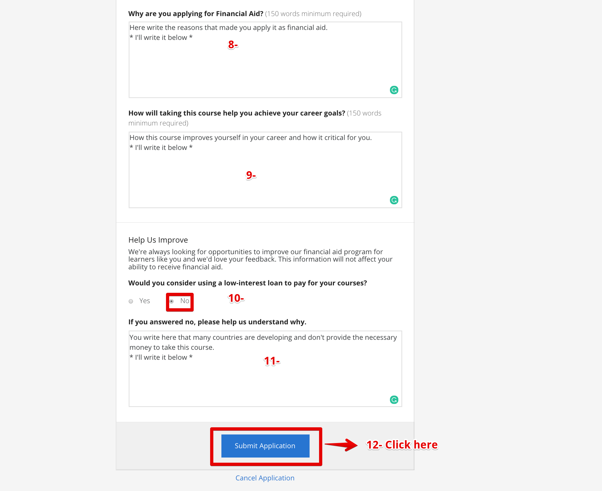

# Coursera_Financial_Aid

Template Answers that were snowballed from internet, for applying for Coursera financial Aid.
You are free to use the template answers but be sure to change them before applying and be truthful.

Best of Luck!!!!
Do not forget to star this repository.

---

## Everything between quotes you should change it 

